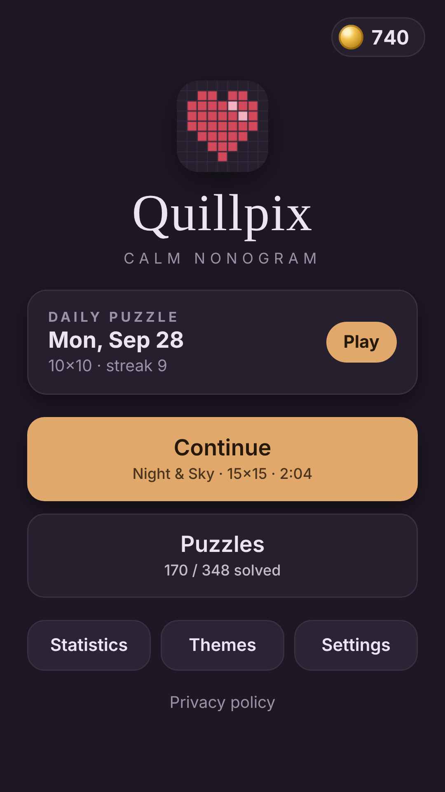
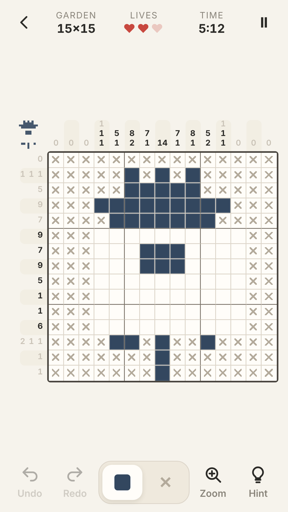
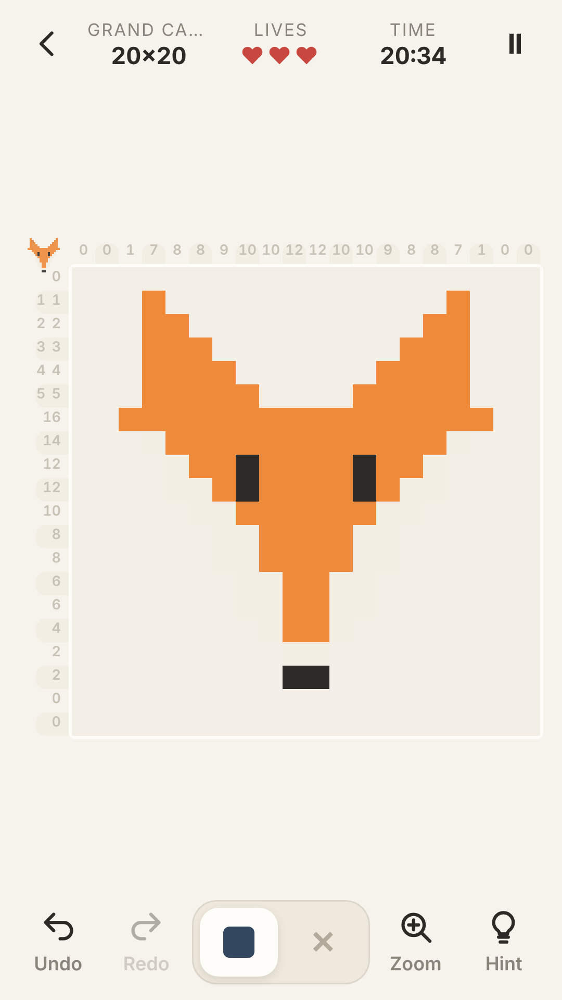
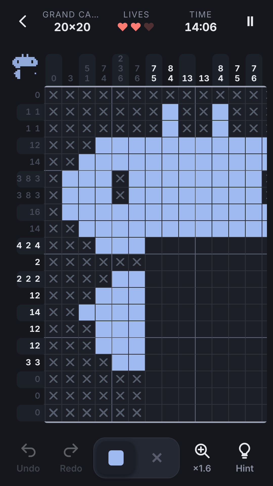

# Quillpix: Calm Nonogram

A calm, **offline nonogram** (picture logic puzzle, also called picross or griddlers) with **348 bundled puzzles** from 5×5 to 20×20 in 11 themed packs, plus a new **daily puzzle** every day, generated on the device from the date. Every puzzle is **original pixel art** made for this game, and every one is **verified by a line solver**: it can be solved from its clues by line logic alone, which also proves the solution is **unique**. Solving reveals the picture in colour. It's written in vanilla HTML/CSS/JavaScript with no framework, and ships as an **Android app** (Capacitor 8 + Google AdMob) that **GitHub Actions** builds and signs automatically.

**▶ Play the live demo:** https://offerpk.github.io/nonogram/
**Privacy policy:** https://offerpk.github.io/nonogram/privacy.html
**Android downloads (signed AAB/APK):** [Releases](https://github.com/OfferPk/nonogram/releases)

<p align="center">
  
  
  
  
</p>

## How to play

- The numbers beside each row and above each column are the lengths of the runs of filled squares in that line, in order, with at least one empty square between runs. `3 1` means three filled, a gap, then one filled.
- **Tap** a square to fill it. Switch to **✕** to mark squares you know are empty. **Drag** along a row or column to mark a whole stretch of a line in one stroke (the drag locks to the row or column you start in; one drag = one undo step).
- **Clue numbers grey out** as they're completed (from either edge, and the whole clue when the line is satisfied). **Auto-cross** fills the rest of a finished line with ✕ (can be turned off).
- **Undo / Redo** any move. **Pinch to zoom** and pan with two fingers on big grids, or use the **Zoom** button (1× → 1.6× → max). The clue strips follow the grid while you pan.
- **Mistake mode** (default): a wrong mark is corrected on the spot and costs one of **3 lives**. **Free mode** (Settings): no checking at all, just you and the clues.
- **Hint: reveal a line** (▶ rewarded ad, **only when you tap it**) fills in the most useful unfinished row or column. **Extra life** (▶ rewarded ad) is offered on the "No lives left" screen.
- The **timer** pauses with the pause button (the board is hidden while paused) and automatically when the app goes to the background. The game **auto-saves after every move**; every puzzle keeps its own progress and **Continue** resumes the last one.
- A finished puzzle plays a **colour reveal** wave, then shows the picture, your time, best time and coins.
- Solving a puzzle for the first time earns **coins** (5–50 by size, +10 for the daily) that unlock cosmetic **themes**. Coins can't be bought, cashed out or used for anything else. There are no purchases.

## Puzzles

| Pack | Puzzles | Sizes |
|---|---|---|
| First Steps | 34 | 5×5 (hand-drawn) |
| Little Things | 30 | 8×8 (hand-drawn + rasterised) |
| Garden, Seaside, Animal Friends, Sweet Treats | 30 each | 10×10, 15×15 |
| Night & Sky, Cozy Home, On the Road | 30 each | 12×12, 15×15 |
| Quilt Mosaics | 42 | 10×10 to 20×20 (procedural symmetric patterns) |
| Grand Canvas | 32 | 20×20 |

- **Original art only.** Small pictures are hand-drawn ASCII pixel art (`tools/art-small.js`); larger ones are original vector motifs (circles, polygons, strokes, cut-out holes) in `tools/motifs.js`, rasterised at each size with 5×5 supersampling (`tools/build-puzzles.js`). Mosaics are seeded, 8-way symmetric cellular patterns (`mosaicImage()` in `www/js/logic.js`). No copyrighted characters.
- **Verified unique and logic-solvable.** `solveLine()` is an exact line solver (forward/backward DP over block placements: a cell is set only if it has the same value in *every* arrangement consistent with the clue). `lineSolve()` iterates rows and columns to a fixpoint. A puzzle is accepted only if this solves every cell and matches the picture, which implies exactly one solution. If a rasterised picture isn't line-solvable, `makeSolvable()` flips a still-undetermined square at a time (keeping flips that reduce the unknowns) until it is; the build tries several rasterisation thresholds and keeps the version with the fewest flips (average 0.2 flips per puzzle). Duplicate pictures are rejected.
- **Daily puzzle:** a quilt mosaic seeded by the local date (`hashString('quillpix-daily-YYYY-MM-DD')`), repaired to be line-solvable, size by weekday (Mon/Tue 10×10, Wed/Thu 12×12, Fri–Sun 15×15). Same for everyone on that day, fully offline, with a daily streak.
- `node tools/build-puzzles.js` rebuilds `www/js/puzzles.js` deterministically; CI checks the committed file matches. `python3 tools/preview.py <dir>` renders a contact sheet per pack.

## Features

- **Stats:** puzzles solved, flawless solves (no mistakes, no hints), total play time, lines revealed, daily streak and best streak, and a per-size table with solved count, best and average time.
- **5 themes:** Paper and Midnight (dark) are free; Sage, Dusk (dark) and Blush are unlocked with coins.
- A calm, adult (13+) look: soft paper and ink colours, serif title, gentle animations, **WebAudio** synthesized sounds (no audio files) and light **haptics** via `@capacitor/haptics`. Android back button follows the screen hierarchy (browser history). Keyboard on the web: Ctrl+Z / Ctrl+Y, X toggles fill/cross, mouse wheel zoom/pan.
- No build step: open `www/index.html` or serve the folder.

## Project layout

```
www/                  ← the whole game (also the Capacitor webDir & the Pages site)
  index.html, css/style.css, privacy.html, icon.png
  js/logic.js         ← pure rules: clues, line solver, line-solving, uniqueness counter, repair, mosaics, daily, input rules, hints
  js/puzzles.js       ← GENERATED puzzle data (348 puzzles, palette)
  js/game.js          ← screens, board, input (tap/drag/cross/pinch/pan), undo/redo, timer, save/resume, reveal, stats, themes
  js/sound.js         ← WebAudio SFX
  js/themes.js        ← cosmetic theme catalog
  js/ads-config.js    ← ★ ALL AdMob IDs + pacing numbers live here
  js/adgate.js        ← interstitial pacing rules (pure, unit-tested)
  js/ads.js           ← UMP consent, banner, interstitial, rewarded
tools/                ← puzzle builder, original art (small ASCII + vector motifs), palette, preview renderer
android/              ← Capacitor Android project (committed)
assets/               ← icon/splash generator (make_icon.py) + 512 px store icon
store/                ← Google Play listing kit (graphics, text, answers, checklist, capture scripts)
test/                 ← Node tests (solver, puzzles, input, ad gate) and a headless-Chrome play test
.github/workflows/    ← android.yml (tests + signed AAB/APK + Releases), pages.yml (web demo + live-site browser test)
```

## Run locally

```bash
npm install
npm run serve          # http://localhost:8080
npm test               # line solver vs brute force, every bundled puzzle line-solvable/unique, clues, input, daily seed, ad pacing
```

Headless phone-size play test (plays with taps and a drag: mistake mode, cross mode, drag-a-line, clue grey-out, undo/redo, reload + resume, solving a 5×5 with reveal/stats/coins/ad gate, persistence, hint, daily, zoom, dark theme, and fails on any console error). CI runs it against the live Pages site after every deploy:

```bash
npm i --no-save puppeteer-core
PUPPETEER=puppeteer-core node test/browser.test.js http://localhost:8080/ /tmp   # Chrome at /usr/bin/google-chrome (or CHROME=...)
```

## Ads (AdMob) and the ad rules

| Hook | When | In a browser |
|---|---|---|
| `Ads.init()` | on launch: **UMP consent** + SDK init only, **no ad is shown** | no-op |
| `Ads.showBanner()` | only while the **gameplay screen** is open (adaptive banner at the bottom; the game screen reserves its height so it never covers the grid or toolbar) | no-op |
| `Ads.maybeInterstitial(gate)` | only when leaving the **Puzzle solved** screen (**Next puzzle** or **Home**), when `AdGate` allows it | never |
| `Ads.showRewarded(cb)` | only when the player taps **Hint** or **Extra life & continue**. The reward is granted only on the SDK's *earned reward* event | grants the reward immediately |

Interstitial pacing, enforced in `www/js/adgate.js` and tested in `test/adgate.test.js`:

- **None** until the player has solved **5 puzzles** *and* played for **3 minutes** in total (timer running).
- After that, at most **one every 3 solved puzzles** and at most **one per 90 s**, only on the puzzle-complete transition. If an ad isn't ready, the game simply continues.
- **Never** on launch, exit, back press or mid-puzzle. There are no app-open ads, and the pacing state is saved so restarting the app doesn't reset it.

### Swapping in your real AdMob IDs

The repo uses **Google's official test IDs**. Change them in exactly **two** places:

1. **`www/js/ads-config.js`**: set `APP_ID`, `BANNER_ID`, `INTERSTITIAL_ID` and `REWARDED_ID`, then set `IS_TESTING: false`.
2. **`android/app/src/main/AndroidManifest.xml`**: set the `com.google.android.gms.ads.APPLICATION_ID` meta-data value to your real **App ID** (`ca-app-pub-XXXX~YYYY`).

Then bump the version, commit and tag. CI builds a new signed AAB. In AdMob, also publish a **Privacy & messaging → GDPR message** so the consent form appears, and add an `app-ads.txt` to your developer website.

## Android build

- Capacitor 8, appId **`com.offerpk.nonogram`**, name **Quillpix**, plugins `@capacitor-community/admob` 8.1.0 and `@capacitor/haptics` 8.
- `compileSdk`/`targetSdk` **36**, `minSdk` **24**, versionCode **1**, versionName **1.0.0** (in `android/app/build.gradle` / `android/variables.gradle`).
- Permissions: `INTERNET`, `ACCESS_NETWORK_STATE`, `AD_ID` (AdMob) and `VIBRATE` (haptics). No billing: the game has no purchases.

### CI (GitHub Actions)

`.github/workflows/android.yml` runs on every push to `main`, on `v*` tags, and on manual dispatch: Node 22 + JDK 21 → `npm ci` → deterministic puzzle rebuild must match the committed data → `npm test` → `npx cap sync android` → `./gradlew bundleRelease assembleRelease` → it prints the APK's `targetSdkVersion` with `aapt2` and verifies the signatures. The signed **`.aab`** and **`.apk`** are uploaded as artifacts, and a `v*` tag also creates a **GitHub Release** with both files attached. `pages.yml` deploys `www/` to GitHub Pages and then runs the headless-Chrome play test against the live site.

Signing uses these repository secrets (the keystore and passwords are **never** committed):

| Secret | Contents |
|---|---|
| `KEYSTORE_BASE64` | `base64 -w0 upload.jks` |
| `KEYSTORE_PASSWORD` | keystore password |
| `KEY_ALIAS` | key alias (`upload`) |
| `KEY_PASSWORD` | key password |

### Build locally

```bash
npm ci
npx cap sync android
cd android
ANDROID_KEYSTORE_FILE=/path/upload.jks KEYSTORE_PASSWORD=... KEY_ALIAS=upload KEY_PASSWORD=... \
  ./gradlew bundleRelease assembleRelease
```

### Icons and splash

`python3 assets/make_icon.py` regenerates the original launcher icons (legacy, round and adaptive foreground), the splash screens, `www/icon.png` and the 512 px store icons.

## Releasing to Google Play

See **[`store/LAUNCH-CHECKLIST.md`](store/LAUNCH-CHECKLIST.md)** (it opens with a Roman Urdu summary), [`store/listing-en.md`](store/listing-en.md) and [`store/play-console-answers.md`](store/play-console-answers.md).

1. Bump `versionCode` (+1 every upload) and `versionName`, and switch to your real AdMob IDs.
2. `git tag v1.0.1 && git push origin v1.0.1`. CI attaches `nonogram-v1.0.1.aab` and `.apk` to a Release.
3. Upload the `.aab` in Play Console with **Play App Signing** turned on. The CI keystore is your **upload key**.

## License

[MIT](LICENSE) © 2026 OfferPk. See also the [Privacy Policy](PRIVACY.md).
